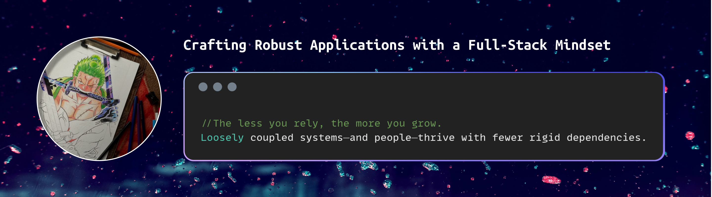

   

<h3 align="center">🚀 Java Enthusiast | Eager to learn</h3>

- 🔭 I’m currently working on [Artwork-Selling-Webapp](https://github.com/GLADIUS240/Artwork-Selling-webapp)
- 📫 How to reach me **deepakbora0000@gmail.com**

<h2 align="center">🔥 Languages & Frameworks & Tools & Abilities 🔥</h2> 

    
    
    
    
    
    
    
    
    
    
    
    
    
    

<h2 align="center">⚡ Stats ⚡</h2> 

   
  &nbsp;&nbsp;&nbsp;
   

  

    

  

<h2 align="center">Connect with me:</h2> 

    
    
    

    

<h2 align="center">🎸 Activity:</h2> 

    

        
    

 

